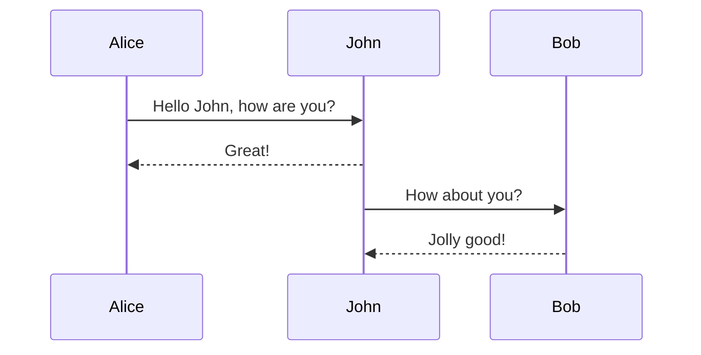

# Hello World
This is an example diagram



# Examples
## More
### More

This is an alert with a **bold** and a code block `code` and some *italic* text.



- My list 1
- My list 2
- My list 3

```kotlin
fun test() {
    printLn("Ahhh")
}
```

## Testing
- [ ] Check
- [ ] Check 2

### More
1. a
2. b
3. d

{}

## Code Block Examples

Code block language examples

### Go

```go
package main

import "fmt"

func main() {
    fmt.Println("hello world")
}
```

### HTML

```html
<!DOCTYPE html>
<html>
<body>

<h1>My First Heading</h1>

<p>My first paragraph.</p>

</body>
</html>
```

### Markdown

```md
# H1 heading

**Some bold text**

*Italic text example*
```
